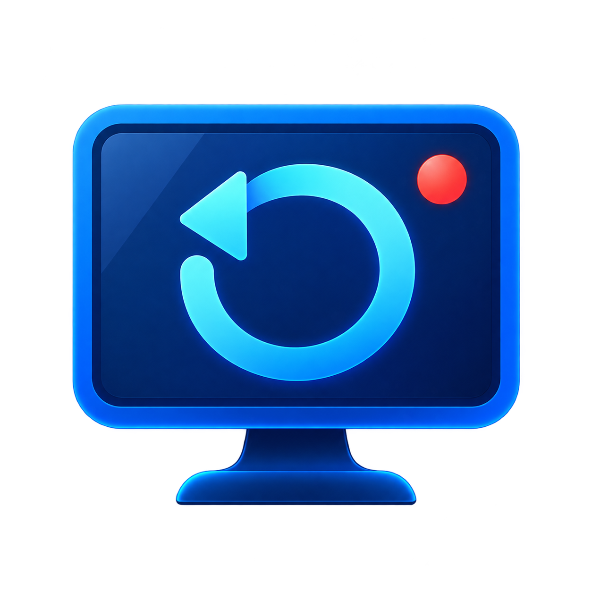
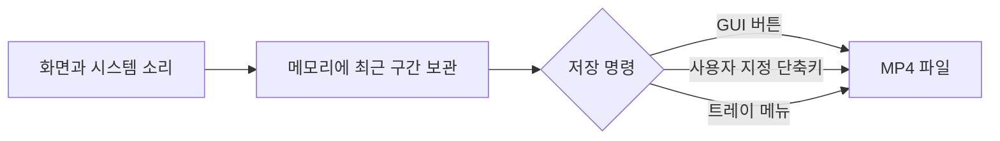
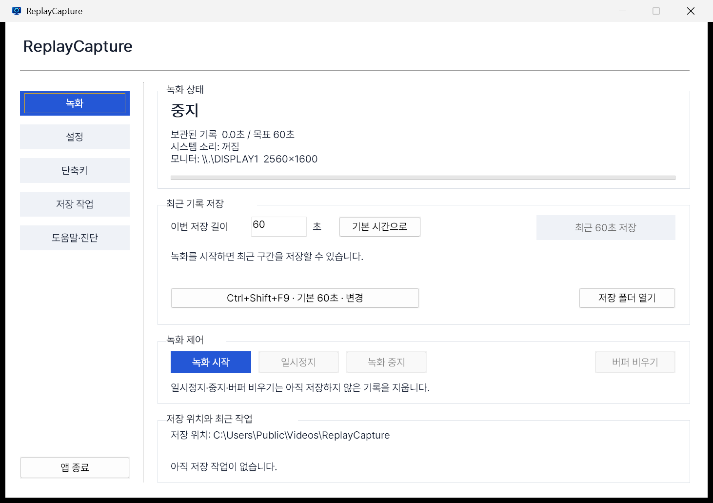
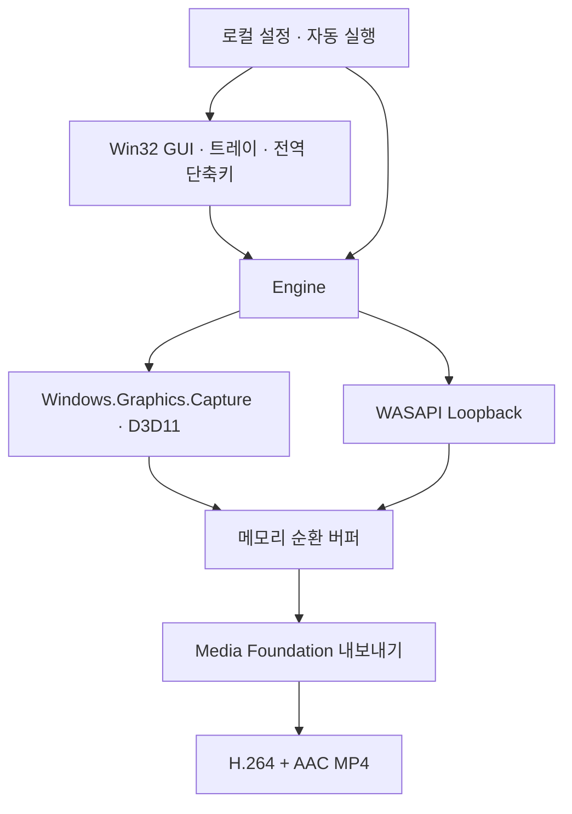

<div align="center">



# ReplayCapture 🎬

**지나간 화면과 시스템 소리를, 필요해진 순간에 저장하는 Windows 리플레이 녹화기**


[사용자 안내](#-일반-사용자-가이드) · [개발자 안내](#-외부-개발자-가이드) · [문서 모음](docs/README.md) · [문제 해결](docs/troubleshooting.md)

</div>

## ReplayCapture는 어떤 프로그램인가요? 🤔

ReplayCapture는 화면을 계속 임시 보관하다가 사용자가 버튼이나 단축키를 누르면 **방금 지나간 구간만 MP4 파일로 저장**합니다. 게임의 멋진 장면, 온라인 수업의 중요한 설명, 작업 중 재현하기 어려운 오류처럼 녹화를 미리 시작하지 못한 순간에 적합합니다.

> ### 이런 분들을 위해 만들었습니다
>
> - 🎮 방금 지나간 게임 장면을 빠르게 남기고 싶은 사용자
> - 🧑‍💻 재현하기 어려운 화면 오류와 시스템 소리를 함께 보관하려는 사용자
> - 📚 강의나 회의에서 놓친 직전 설명을 다시 확인하려는 사용자



# 👤 일반 사용자 가이드

> 배포된 ReplayCapture를 사용하는 분을 위한 안내입니다. 소스 코드나 개발 도구는 필요하지 않습니다.

## 🚀 세 단계로 시작하기



> 실제 GUI 화면입니다. 저장 폴더는 예시 경로이며, 설정에서 변경할 수 있습니다.

<table>
  <tr>
    <th width="15%">단계</th>
    <th width="25%">할 일</th>
    <th>설명</th>
  </tr>
  <tr>
    <td align="center">1️⃣</td>
    <td><b>실행</b></td>
    <td>배포받은 ZIP의 압축을 풀고 <code>ReplayCapture.exe</code>를 실행합니다.</td>
  </tr>
  <tr>
    <td align="center">2️⃣</td>
    <td><b>녹화 시작</b></td>
    <td><b>설정</b> 탭에서 모니터와 시스템 오디오 장치를 선택·적용한 뒤 <b>녹화</b> 탭의 <b>녹화 시작</b>을 누릅니다.</td>
  </tr>
  <tr>
    <td align="center">3️⃣</td>
    <td><b>최근 기록 저장</b></td>
    <td><b>최근 기록 저장</b> 버튼 또는 기본 단축키 <kbd>Ctrl</kbd> + <kbd>Shift</kbd> + <kbd>F9</kbd>를 누릅니다.</td>
  </tr>
</table>

저장된 파일은 설정한 폴더에 `Replay_날짜_시간_작업번호.mp4` 형식으로 생성됩니다. 단축키는 **단축키** 탭에서 원하는 조합으로 바꿀 수 있습니다.

## ✨ 주요 기능

| 기능 | 사용자에게 보이는 동작 |
|---|---|
| 🔄 최근 기록 보관 | 선택한 시간만큼 화면과 시스템 소리를 메모리에 계속 보관합니다. |
| 💾 즉시 저장 | GUI 버튼, 전역 단축키, 트레이 메뉴로 최근 구간을 MP4로 저장합니다. |
| ⌨️ 단축키 변경 | 다른 프로그램과 겹치지 않는 조합으로 직접 지정할 수 있습니다. |
| ⏱️ 시간 설정 | 보관 시간, 기본 저장 시간, GUI에서 이번에 저장할 시간을 각각 설정합니다. |
| 🖥️ 장치 선택 | 녹화할 모니터와 시스템 오디오 출력 장치를 선택합니다. |
| 🎛️ 품질 설정 | 해상도, 프레임률, 비트레이트와 메모리 한도를 조절합니다. |
| 🧰 백그라운드 동작 | 창을 닫아도 트레이에서 계속 동작하며 알림으로 상태를 알려 줍니다. |
| 🔒 로컬 처리 | 녹화 데이터와 설정은 PC에서 처리되며 외부 서버로 전송하지 않습니다. |

## ⏱️ 시간 설정은 어떻게 다른가요?

| 설정 | 의미 | 예시 |
|---|---|---|
| **보관 시간** | 메모리에 유지하는 최근 기록의 최대 길이 | 120초로 설정하면 최대 최근 2분을 보관 |
| **기본 저장 시간** | 단축키나 트레이 메뉴를 사용할 때 저장할 길이 | 60초로 설정하면 기본 저장 명령으로 최근 1분 저장 |
| **이번 저장 시간** | GUI 버튼으로 지금 한 번만 저장할 길이 | 기본값을 바꾸지 않고 이번만 30초 저장 |

> 💡 기본 저장 시간은 보관 시간보다 길 수 없습니다. 녹화를 막 시작했거나 버퍼가 초기화된 직후에는 실제 저장 길이가 더 짧을 수 있습니다.

## 🧭 자주 쓰는 조작

고정 크기 창의 왼쪽 메뉴에서 기능을 선택합니다. **설정 → 고급 설정**에서 화질·메모리를 조절하고, **기본 설정** 버튼으로 돌아옵니다. 입력 오류는 설정 화면 하단에 표시됩니다. 글꼴은 Pretendard를 내장하여 별도 설치 없이 적용됩니다.

| 목적 | GUI 위치 또는 조작 |
|---|---|
| 단축키 바꾸기 | **단축키** 탭에서 새 조합 입력 후 적용 |
| 저장 폴더 바꾸기 | **설정** 탭에서 폴더 선택 후 **설정 적용** |
| 잠시 멈추기 | 메인 화면의 **일시 정지** |
| 완전히 종료하기 | 트레이 아이콘 우클릭 → **앱 종료** |
| Windows 시작 시 실행 | **설정** 탭의 **Windows 로그인 시 앱 자동 실행** |

창의 `X` 버튼은 프로그램을 종료하지 않고 트레이로 숨깁니다. 일시 정지, 화면 잠금, 절전 중에는 버퍼를 비우며, 다시 시작하거나 잠금이 해제되면 빈 버퍼에서 녹화를 이어 갑니다.

## ✅ 지원 범위

- Windows 11 x64, 단일 SDR 모니터, 시스템 출력 오디오를 지원합니다.
- MP4 컨테이너에 H.264 영상과 AAC 오디오를 저장합니다.
- 빠른 저장을 위해 앞쪽 키프레임부터 내보내므로 요청 시간보다 약간 길어질 수 있습니다.
- 마이크 녹음, HDR, 여러 모니터 합성, 프레임 단위 편집은 현재 지원하지 않습니다.
- 보호된 영상, 보안 데스크톱, 일부 원격 데스크톱 화면은 운영체제 정책에 따라 녹화되지 않을 수 있습니다.

더 자세한 조작은 [GUI·단축키 사용자 가이드](docs/gui-and-hotkeys.md), 오류 해결은 [문제 해결 가이드](docs/troubleshooting.md)를 확인하세요.

# 🛠️ 외부 개발자 가이드

> 저장소를 빌드하거나 구조를 이해하려는 개발자를 위한 요약입니다. 구현 근거와 검증 범위는 `docs/` 문서에서 확인할 수 있습니다.

## 🧩 구성



## 🧰 기술 스택

<div>
  
  
  
  
  
  
  
</div>

## 🔨 빌드와 검증

요구 환경은 Visual Studio 2022 Build Tools의 MSVC, Windows 11 SDK, CMake 3.25 이상입니다.

```powershell
cmake -S . -B build -G "Visual Studio 17 2022" -A x64
cmake --build build --config Release
ctest --test-dir build -C Release --output-on-failure
```

배포 ZIP을 만들려면 다음 명령을 실행합니다.

```powershell
cmake --install build --config Release --prefix dist/ReplayCapture-0.1.0-windows-x64
cmake -E tar cfv dist/ReplayCapture-0.1.0-windows-x64.zip --format=zip -- dist/ReplayCapture-0.1.0-windows-x64
```

## 📚 개발 문서

| 문서 | 대상과 내용 |
|---|---|
| [문서 안내](docs/README.md) | 사용자·개발자 문서 전체 탐색 |
| [아키텍처](docs/architecture.md) | 모듈, 데이터 흐름, 주요 설계 선택 |
| [검증 보고서](docs/validation-report.md) | 통과한 검증과 아직 남은 검증 |
| [초기 구현 계획](WINDOWS_REPLAY_RECORDER_PLAN.ko.md) | 최초 요구사항과 설계 판단의 역사 기록 |

핵심 코드는 `src/`, 단위 테스트는 `tests/`, 앱 아이콘은 `assets/`에 있습니다. 현재 검증에서는 실제 화면·시스템 오디오 녹화, 동시에 요청한 3개 저장 작업, GUI·단축키·설정 유지, 배포 ZIP 재실행까지 확인했습니다. 장시간 안정성 및 여러 GPU 환경 검증은 아직 남아 있습니다.

## 📌 프로젝트 정보

- 저장소: [RyuGernwoo/ReplayCapture](https://github.com/RyuGernwoo/ReplayCapture)
- 작성자: RyuGernwoo
- 문의: [qesadgun@gmail.com](mailto:qesadgun@gmail.com)
- 현재 버전: `0.1.0`
- 배포 참고: 현재 빌드는 코드 서명이 적용되지 않아 Windows가 게시자 경고를 표시할 수 있습니다.
