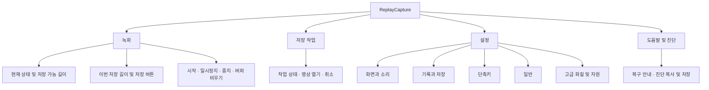

# ReplayCapture GUI 디자인 개선 상세 계획서

> 2026-09-11 사용자 요청으로 가변 창·본문 스크롤 계획을 고정 크기 창으로 대체했습니다. [최신 변경과 검증](GUI_FIXED_LAYOUT_REPORT.ko.md)을 참고하세요.

> **문서 상태: 초기 설계 기록 · 구현 결과는 별도 보고서 참조**
>
> 현재 Win32 GUI와 녹화 엔진을 기준으로 작성한 화면 개선 계획이다. 아래 화면, 수치, 일정은 설계안과 검증 목표이며 구현 완료나 사용성 검증 결과가 아니다.

후속 요청에 따라 GUI 개선과 개발자 검증을 진행했다. 사용자 평가는 요청에 따라 생략한다. 실제 적용 범위·설계 조정·성능 측정은 [GUI 구현 보고서](GUI_IMPLEMENTATION_REPORT.ko.md)를 기준으로 확인한다.

- 작성일: 2026-09-10
- 기준: 현재 저장소의 `src/main.cpp`, `src/settings.*`, `src/engine.*`
- 대상: Windows용 배포 프로그램 사용자 및 후속 구현 담당 개발자
- 목표: 사용자가 녹화 상태를 이해하고, 원하는 최근 구간을 확신을 가지고 저장하도록 개선
- 관련 문서: [사용자 가이드](gui-and-hotkeys.md) · [아키텍처](architecture.md) · [검증 보고서](validation-report.md)

## 1. 개선 방향과 성공 기준

### 1.1 핵심 경험

앱을 열면 다음 세 질문에 즉시 답할 수 있어야 한다.

1. 지금 화면과 시스템 소리가 기록되고 있는가?
2. 현재 몇 초를 저장할 수 있는가?
3. 어느 버튼을 누르면 어디에 저장되는가?

일반 사용자는 배포 파일을 실행하고 GUI로 모든 기능을 사용한다. 최근 기록 저장은 GUI 버튼과 사용자 지정 전역 단축키 모두 지원한다. 개발 도구, 명령줄, 설정 파일 편집을 사용자 경로로 요구하지 않는다.

### 1.2 우선순위

| 우선순위 | 개선 | 완료 판단 |
|---|---|---|
| P0 | 저장 버튼과 녹화 상태의 시각적 우선순위 | 첫 화면에서 상태·가능 길이·저장 위치 확인 |
| P0 | 시간 개념과 버퍼 초기화 안내 | 보관 시간과 저장 길이를 구분하고 손실 시점을 예측 |
| P0 | 오류·비활성 이유와 복구 행동 | 저장 실패 시 이유와 다음 행동을 함께 제공 |
| P0 | 기존 모든 GUI 기능 유지 | 기존 기능 대응표 전 항목 통과 |
| P1 | 설정 그룹화와 변경 적용 경험 | 일반 설정을 이해하고 고급 설정은 필요할 때 펼침 |
| P1 | 창 크기·DPI·키보드 접근성 | 작은 화면과 확대 환경에서 모든 기능 도달 |
| P1 | 저장 작업과 진단 정리 | 결과 파일 열기와 오류 진단까지 연결 |
| P2 | 추가 테마·장식·미세 애니메이션 | 핵심 흐름 검증 후 선택 적용 |

실시간 화면 미리보기, 오디오 파형, 영상 편집기, 영구 파일 라이브러리는 이번 기본 범위에 포함하지 않는다. 현재 엔진이 제공하지 않는 데이터를 보여 주기 위해 녹화 부하와 기능 범위를 확대하지 않는다.

## 2. 현재 GUI 진단

다음은 소스 구조에서 확인한 관찰이며, 실제 사용자 조사 결과는 아니다.

| 현재 구성 | 사용성 위험 | 개선 방향 |
|---|---|---|
| 녹화·설정·단축키·저장 작업·진단 탭 | 핵심 행동과 보조 기능의 중요도가 비슷해 보임 | 녹화 중심 대시보드와 보조 탐색 분리 |
| 고정 좌표 기반 배치, 창 크기 변경 미지원 | 작은 작업 영역과 큰 배율에서 접근성 저하 가능 | 가용 영역 기반 배치 및 스크롤 |
| 상태 요약이 여러 줄 텍스트로 묶임 | 녹화 여부와 확보 시간을 빠르게 찾기 어려움 | 상태 배지, 시간 수치, 장치 요약 분리 |
| 시작·일시정지·중지·버퍼 비우기가 나란함 | 빈번한 행동과 기록 제거 행동 혼동 가능 | 저장을 강조하고 기록 제거는 보조 영역 배치 |
| 장치·시간·화질·메모리가 설정 한 화면에 밀집 | 일반 사용자가 전문 항목까지 읽어야 함 | 기본 설정과 고급 설정 구분 |
| 보관 시간·기본 저장·이번 저장 길이 | 비슷한 숫자의 역할 혼동 | 문구와 예시를 함께 제공 |
| 저장 작업의 파일 경로와 메시지가 같은 열 | 실패 이유와 결과 위치 파악이 어려움 | 상태·길이·파일·상세 영역 분리 |
| 일시정지도 버퍼를 비우는 엔진 동작 | 재개하면 기존 기록이 남아 있을 것으로 오해 | 행동 전에 영향 안내, 재개 뒤 기록 다시 쌓기 표시 |

기존의 사용자 지정 단축키, 설정 유효성 검사, 트레이 조작, 저장 큐와 진단 기능은 개선의 기반으로 유지한다.

## 3. 정보 구조



넓은 창에서는 왼쪽 탐색 영역을 사용한다. 좁은 창에서는 같은 순서의 상단 탐색으로 바꾼다. 단축키는 설정 하위 항목으로 이동하되 대시보드의 현재 단축키 표시에서 직접 접근하도록 한다.

### 기존 기능 대응표

| 기존 기능 | 새 위치 | 필수 유지 조건 |
|---|---|---|
| 시작·일시정지·재개·중지 | 녹화 제어 영역 | 상태에 맞는 문구와 활성 여부 |
| 버퍼 비우기 | 녹화 보조 행동 | GUI에서 직접 접근, 영향 안내 |
| 이번 길이·기본 시간 복원·저장 | 대시보드 저장 카드 | 버튼은 이번 길이만 사용 |
| 모니터·오디오·장치 새로고침 | 설정 → 화면과 소리 | 선택 불가 장치 안내 |
| 시스템 소리·영상만 허용 | 설정 → 화면과 소리 | 무음 저장 정책을 명시 |
| 보관·기본 저장·전체 길이 대기 | 설정 → 기록과 저장 | 기존 유효성 계약 유지 |
| 폴더 선택·열기 | 설정 및 대시보드 | 현재 적용된 경로 표시 |
| 출력 폭·높이·FPS·비트레이트 | 설정 → 고급 | 임의의 품질 향상 효과를 보장하지 않음 |
| 압축 메모리·총 예산·대기 수 | 설정 → 고급 | 현재 엔진의 자원 제한 유지 |
| 알림·자동 실행·기본값 복원 | 설정 → 일반 | 적용 성공·실패 표시 |
| 단축키 변경·복원·테스트 | 설정 → 단축키 | 충돌 롤백·테스트 중 저장 억제 |
| 영상 열기·폴더에서 보기·취소 | 저장 작업 | 선택 작업 상태에 따라 활성화 |
| 진단 복사·파일 저장·재연결 | 도움말 및 진단 | 오류 상세에 GUI로 접근 |
| 트레이·앱 종료 | 트레이 및 공통 메뉴 | 창 닫기와 종료 구분 |

## 4. 시각 디자인 시스템

### 4.1 기본 스타일

기본안은 밝은 회색 배경과 흰색 콘텐츠 영역, 파란색 주요 버튼을 사용한다. 기존 앱 아이콘을 제목·트레이·실행 파일에 일관되게 사용한다. 앱 내부에는 의미가 명확한 단색 아이콘과 텍스트를 함께 배치하고, 플랫폼에 따라 모양이 달라지는 이모지로 상태를 표현하지 않는다.

아래 값은 구현 시 조정 가능한 초기 토큰이다. 대비 측정은 별도 검증 단계에서 수행한다.

| 토큰 | 제안값 | 용도 |
|---|---|---|
| 배경 | #F5F7FA | 창 전체 |
| 콘텐츠 면 | #FFFFFF | 카드·설정 그룹 |
| 기본 글자 | #172033 | 제목·본문 |
| 보조 글자 | #526176 | 도움말·설명 |
| 강조 | #2457D6 | 주요 저장 버튼·선택 |
| 성공 | #167347 | 저장 완료 |
| 주의 | #8A5600 | 기록 부족·무음 저장 안내 |
| 오류 | #B42318 | 실패·복구 필요 |
| 테두리 | #D8DEE8 | 그룹 구분 |
| 포커스 | #1747B0 | 키보드 위치 표시 |

- 간격 단위: 4, 8, 12, 16, 24, 32 DIP.
- 기본 본문: 14–16 DIP, 제목: 22–26 DIP, 확보 시간: 28–32 DIP.
- 한글 글꼴은 현재 맑은 고딕을 출발점으로 하며 시스템 글꼴과 글자 확대를 검증한다.
- 주요 버튼 높이 44 DIP, 일반 컨트롤 최소 36 DIP를 초기 목표로 한다.
- 카드 모서리는 8 DIP 내외로 제한하고 과한 그림자·투명 효과는 피한다.
- 색상만으로 상태를 구분하지 않고 상태 이름·아이콘·설명을 함께 제공한다.
- 고대비 모드에서는 사용자 지정 색보다 시스템 색을 우선한다.
- 다크 테마는 기본 범위 완료 후 별도 검증을 거쳐 추가한다.

### 4.2 창과 배치

초기 창 크기는 약 1040×760 DIP를 제안하되 실제 모니터 작업 영역을 넘지 않도록 제한한다. 900 DIP 부근에서 탐색 배치를 전환하는 것을 시작값으로 삼고 실제 콘텐츠 폭으로 조정한다.

- 넓은 화면: 184 DIP 내외 탐색 영역과 유동 콘텐츠 영역.
- 좁은 화면: 상단 탐색, 카드 한 열, 설명 줄바꿈.
- 작은 높이: 본문 스크롤. 저장 행동과 포커스 컨트롤은 접근 가능해야 한다.
- 최소 크기는 작업 영역보다 커지지 않도록 계산한다.
- 100·125·150·175·200% 배율에서 검증하며 서로 다른 DPI 모니터 이동도 포함한다.
- 경로와 장치 이름은 줄임표로 축약하되 전체 내용 확인·복사 수단을 제공한다.
- 매 프레임 전체 창을 다시 그리지 않고 변경된 상태 영역만 갱신한다.

## 5. 녹화 대시보드

### 5.1 화면 초안

아래는 공간 관계를 설명하는 와이어프레임이며 실제 화면 캡처가 아니다.

```text
┌ ReplayCapture ──────────────────────────────────────────────┐
│ 녹화        │ ● 녹화 중           시스템 소리 포함           │
│ 저장 작업   │ 최근 기록  48초 / 보관 목표 120초               │
│ 설정        │ [━━━━━━━━━━━━                         ]        │
│ 도움말·진단 │                                              │
│             │ 최근 기록 저장                               │
│             │ 이번 저장 길이 [60] 초  [기본 시간으로]        │
│             │ 현재 48초 확보 · 지금 저장하면 짧게 저장됨     │
│             │ [             최근 60초 저장              ]  │
│             │ 단축키 Ctrl + Shift + F9 → 기본 60초 [변경]    │
│             │                                              │
│             │ [일시정지] [녹화 중지]       [버퍼 비우기]      │
│             │ 모니터 1 · 스피커                             │
│             │ 저장 위치 C:\Videos\ReplayCapture  [폴더 열기] │
│             │ 최근 작업: 저장 완료  [영상 열기]             │
└────────────────────────────────────────────────────────────┘
```

### 5.2 저장 카드 계약

- 가장 눈에 띄는 버튼은 최근 기록 저장이다. 중지 상태에서는 녹화 시작을 우선 행동으로 보여 준다.
- 버튼 문구는 이번 요청 길이를 반영한다. 확보 길이는 별도 수치로 표시한다.
- 기록 부족 시 실제 저장 가능 길이를 설명하고, 전체 길이 대기 옵션이 켜졌다면 버튼 옆에 대기 이유를 표시한다.
- 30초·60초 등의 빠른 선택은 선택 사항이며 보관 한도를 넘는 값은 선택할 수 없게 한다.
- 요청 길이는 정확한 출력 길이 보장이 아님을 도움말에 설명한다. 키프레임 때문에 파일이 약간 길어질 수 있다.
- 단축키는 기본 저장 길이를 사용한다는 문구를 항상 버튼 근처에 표시한다.
- 저장 요청 직후 접수 상태를 표시하고 작업 목록으로 연결한다.
- 저장 작업이 있다고 녹화 상태를 ‘저장 중’으로 대체하지 않는다. 캡처 상태와 작업 상태를 독립 표시한다.
- 저장 큐 또는 총 메모리 예산 부족은 구체적인 거절 사유와 함께 안내한다.
- 실제 내보내기 비율이 없으므로 가짜 백분율을 표시하지 않는다.

### 5.3 녹화 상태별 표현

| 상태 | 표시 | 주요 행동 |
|---|---|---|
| 최초 실행·중지 | 기록을 시작하면 최근 구간을 저장할 수 있습니다 | 녹화 시작 |
| 시작 중 | 장치를 연결하는 중입니다 | 중지, 중복 시작 방지 |
| 녹화 중·기록 부족 | 현재 확보 시간과 목표 시간 | 부분 저장 또는 대기 |
| 녹화 중·준비 완료 | 최근 기록 저장 가능 | 최근 N초 저장 |
| 일시정지 | 기록이 비워졌습니다. 재개하면 새로 쌓습니다 | 녹화 재개 |
| 복구 중 | 장치 연결을 확인하고 있습니다 | 진단 열기 |
| 오류 | 원인과 복구 행동 | 장치 재선택·재연결 |
| 시스템 소리 꺼짐·대체 녹화 | 소리 없이 녹화 중 | 오디오 설정 |

일시정지·중지·버퍼 비우기 근처에 ‘아직 저장하지 않은 기록이 지워집니다’를 표시한다. 매번 확인창을 띄우는 방식 대신 영향 설명을 기본으로 하고, 설정 적용으로 기록을 비울 때는 적용 전 안내를 명확히 한다.

## 6. 설정 화면

### 6.1 기본과 고급 분리

| 그룹 | 기본 표시 | 추가 설명 |
|---|---|---|
| 화면과 소리 | 모니터, 출력 장치, 시스템 소리 포함 | 연결 실패 시 영상만 허용 정책 |
| 기록과 저장 | 보관 시간, 기본 저장 길이, 저장 폴더 | 전체 길이 대기, 시간 예시 |
| 단축키 | 현재 조합, 변경, 적용, 테스트 | 충돌과 적용 결과 |
| 일반 | 완료·오류 알림, 로그인 시 자동 실행 | 자동 실행은 앱 실행을 의미 |
| 고급 | 접힌 그룹 제목 | 출력 크기, FPS, 비트레이트, 메모리, 저장 대기 수 |

고급 설정을 펼치지 않아도 기본 기능을 사용할 수 있어야 한다. 고급 설정을 숨기더라도 모든 기존 항목을 GUI에서 수정할 수 있어야 한다.

### 6.2 시간 설명

| 화면 문구 | 도움말 |
|---|---|
| 최근 기록 보관 시간 | 메모리에 최대 몇 초까지 남겨 둘지 정합니다 |
| 기본 저장 길이 | 단축키와 트레이로 저장할 길이입니다 |
| 이번 저장 길이 | 녹화 화면의 저장 버튼에만 적용됩니다 |

‘보관 120초 / 기본 저장 60초 → 최대 최근 2분을 유지하고 단축키는 최근 1분 저장’ 예시를 표시한다. 보관 목표보다 메모리 한도로 먼저 기록이 줄어들 수 있으므로 목표 시간과 실제 확보 시간을 구분한다.

### 6.3 편집·적용 계약

1. 적용된 설정과 편집 중인 값을 분리한다.
2. 변경하면 ‘적용되지 않은 변경 사항’과 적용·되돌리기 버튼을 표시한다.
3. 잘못된 값은 해당 항목 바로 아래에 이유를 표시한다.
4. 오류가 있는 상태에서 적용하면 첫 오류로 포커스를 이동한다.
5. 초기 개선에서는 기존 엔진 재시작 정책을 유지하고 ‘설정 적용 시 현재 기록이 비워집니다’를 표시한다.
6. 적용 실패 시 성공으로 표시하지 않고 적용된 값과 재시도 방법을 보여 준다.
7. 기본값 불러오기는 편집 값만 변경하고 실제 적용은 적용 버튼으로 수행한다.
8. 미적용 값이 있는 화면을 떠날 때 유지·적용·폐기를 선택할 수 있게 한다.

향후 알림 같은 일부 설정만 재시작 없이 적용하려면 엔진 변경과 별도 회귀 검증을 먼저 계획한다.

### 6.4 자원 문구

‘압축 메모리’는 ‘최근 기록 메모리 한도’, ‘총 예산’은 ‘녹화·저장 메모리 예산’으로 설명을 보완한다. 총 예산은 전체 프로세스 메모리의 절대 상한이라고 표현하지 않는다. 현재 엔진의 보관 샘플·저장 중 참조·예약량 계산을 반영한 제한임을 고급 도움말에서 설명한다.

## 7. 단축키 경험

- 적용 중인 조합과 편집 중인 조합을 구분한다.
- 키 입력은 기존 지원 범위인 Ctrl·Alt·Shift와 키 조합을 기준으로 한다.
- Windows 키 지원 확대는 이번 시각 개선의 필수 범위로 삼지 않는다.
- 적용 성공은 조합 문자열과 함께 표시한다.
- 충돌 실패 시 기존 조합을 유지하고 ‘다른 조합을 선택하세요’를 표시한다.
- 테스트 모드 진입·입력 수신·종료 상태를 명확히 표시한다.
- 단축키 편집 화면에서 실제 저장을 억제하는 기존 동작을 유지한다.
- 녹화 화면으로 돌아가거나 창을 숨겼을 때 정상 저장되는지 검증한다.
- 키를 누르고 있을 때 한 번만 접수되는 기존 정책을 유지한다.

## 8. 저장 작업과 진단

### 8.1 저장 작업

세션 내 작업 목록이라는 범위를 명시한다. 영구 영상 라이브러리처럼 과거 실행의 모든 파일을 보여 준다고 표현하지 않는다.

| 상태 | 표현 | 가능한 행동 |
|---|---|---|
| 작업 없음 | 아직 저장한 기록이 없습니다 | 녹화 화면으로 이동 |
| 접수·대기 | 순서대로 저장을 준비하고 있습니다 | 취소 |
| 저장 중 | 파일을 작성하고 있습니다 | 지원되는 시점의 취소 |
| 완료 | 요청 길이·실제 길이·파일 이름 | 영상 열기, 폴더에서 보기 |
| 실패 | 읽기 쉬운 원인 | 진단, 폴더·장치 확인 |
| 취소 | 사용자가 취소한 작업 | 상세 확인 |

실패 작업의 재시도 버튼은 원본 스냅샷이 유지되는 경우에만 도입한다. 이미 버려진 최근 구간을 다시 저장할 수 있다고 안내하지 않는다. 선택 항목이 갱신될 때 포커스와 스크롤 위치를 유지한다.

### 8.2 도움말 및 진단

위쪽에는 ‘오디오 연결 확인’, ‘저장 공간 확인’처럼 사용자 행동을 표시하고, 상세 기술 정보는 펼치기 영역에 둔다. 진단 복사·파일 저장·장치 다시 연결 버튼을 유지한다. 진단 공유 전 경로 등 개인 정보가 포함될 수 있음을 간단히 안내한다.

## 9. 트레이와 알림

- 창의 X는 트레이 숨김, 명시적인 앱 종료는 완전 종료라는 기존 계약을 유지한다.
- 트레이 클릭으로 창 복원, 우클릭으로 기존 제어 메뉴를 제공한다.
- 메뉴의 최근 N초 저장은 기본 저장 길이를 사용한다.
- 녹화·중지·오류 상태를 툴팁과 텍스트로 구분한다.
- 저장 완료·오류는 기존 알림 설정을 따른다.
- 단시간 여러 저장 완료는 알림 과다를 피하도록 묶는 방안을 검토한다.
- 앱 종료 시 대기·진행 작업 처리 정책을 확인하고 실제 정책에 맞는 안내를 제공한다.
- 운영체제 알림을 놓쳐도 앱의 작업 목록에서 결과를 확인할 수 있게 한다.

## 10. 접근성과 조작 품질

아래는 내부 수용 목표이며 인증 또는 이미 달성한 표준 준수 주장과 구분한다.

- 일반 본문 대비 4.5:1 이상을 목표로 색상 조합을 측정한다.
- 색각 차이에 관계없이 상태 이름을 읽을 수 있어야 한다.
- Tab·Shift+Tab 순서는 시각적 읽기 순서와 일치해야 한다.
- Enter·Space로 버튼 실행, 방향키로 탐색, Esc로 편집 취소가 예측 가능해야 한다.
- 포커스·선택·비활성·오류 상태를 서로 다르게 표현한다.
- 아이콘만 있는 버튼은 접근 가능한 이름과 툴팁을 제공한다.
- Narrator로 컨트롤 이름·역할·선택 상태를 확인한다.
- 타이머 갱신마다 스크린리더가 상태를 반복 읽지 않도록 의미 있는 전환만 알린다.
- 비활성 버튼의 이유는 버튼 밖의 텍스트에도 표시한다.
- 긴 한글·영문 장치명, 공백 포함 경로, 키보드만 사용하는 흐름을 검증한다.
- 애니메이션은 의미 전달에 필수로 사용하지 않으며 운영체제 동작 감소 설정을 고려한다.

## 11. 구현 구조와 파일 변경 계획

기본 구현은 현재 C++20·Win32 구조를 유지한다. 새로운 GUI 프레임워크 전환은 범위를 늘리므로 이번 계획의 선행 조건으로 삼지 않는다. 네이티브 입력·목록 컨트롤을 우선하고 필요한 부분에만 사용자 지정 그리기를 사용한다.

| 파일 | 계획 |
|---|---|
| `src/main.cpp` | 탐색·레이아웃·이벤트 연결 분리, 창 크기 변경 처리 |
| `src/ui/theme.h` (신규 제안) | 색·간격·타이포그래피 토큰 |
| `src/ui/layout.h/.cpp` (신규 제안) | DPI와 가용 폭에 따른 배치 계산 |
| `src/ui/view_state.h/.cpp` (신규 제안) | 엔진 상태를 화면 문구·활성 상태로 변환 |
| `src/ui/pages.h/.cpp` (신규 제안) | 녹화·설정·작업·진단 화면 구성 |
| `src/settings.*` | UI 환경 설정이 필요할 때만 필드 추가, 기존 설정 호환 |
| `src/engine.*` | 기본 범위에서 캡처·저장 정책 유지, 부족한 상태 정보만 검토 |
| `src/app.rc`, `src/resource.h` | 필요한 아이콘·문자열 리소스 정리 |
| `CMakeLists.txt` | 신규 UI 소스와 문서 패키지 포함 |
| `tests/tests.cpp` | 상태 변환·시간 유효성 등 의미 있는 로직 검증 |
| `tests/ui_probe.py` | 기존 도구를 확인한 뒤 선택자·키보드 탐색 검증 보완 |
| 사용자 가이드·문제 해결·README | 구현 완료 후 실제 화면 이름과 동작에 맞춰 갱신 |

UI 스레드에서 캡처·인코딩·파일 작업을 실행하지 않는다. 기존 상태 조회를 재사용하고 표시용 데이터를 짧게 복사한 뒤 잠금을 해제한다. 테마 변경·리사이즈에서 GDI 객체 수명이 누수되지 않도록 관리한다.

## 12. 단계별 실행 계획

아래 일정은 개발자 1명 기준 초기 추정이다. 환경 문제와 접근성 보완에 따라 조정한다.

| 단계 | 예상 | 작업 | 산출물 및 통과 조건 |
|---|---|---|---|
| 0. 기준 기록 | 0.5–1일 | 기존 기능·상태·화면 캡처, 기준 성능 기록 | 대응표, 동일 조건의 비교 기준 |
| 1. 화면 설계 | 1–2일 | 기본·좁은 화면 및 오류 상태 와이어프레임 | 화면 초안, 문구 목록, 토큰 |
| 2. 레이아웃 기반 | 1–2일 | 창 리사이즈·DPI·탐색·포커스 구조 | 모든 기존 기능 접근 가능 |
| 3. 녹화 대시보드 | 1–2일 | 상태 카드·길이·저장·버퍼 영향 안내 | 주요 저장 흐름 회귀 통과 |
| 4. 설정·단축키 | 1–2일 | 그룹화·검증·미적용 상태·단축키 테스트 | 잘못된 값 적용 방지, 충돌 롤백 |
| 5. 작업·진단 | 1일 | 목록·상세·오류·복구 행동 | 완료·실패·취소 경로 확인 |
| 6. 검증·문서 | 1–2일 | 접근성·DPI·패키지·사용성 확인 | 증거와 남은 항목을 보고서에 기록 |

전체 예상은 약 6.5–12일이다. UI 토큰만 변경한 채 완료로 판단하지 않고 단계별 행동 계약을 통과해야 한다.

## 13. 검증 계획과 완료 기준

### 13.1 기능·표시 검증

| 시나리오 | 기대 결과 |
|---|---|
| 최초 실행 | 장치·저장 위치·녹화 시작을 찾을 수 있음 |
| 120초 보관·60초 기본·30초 이번 저장 | GUI는 30초, 단축키·트레이는 60초 요청 |
| 기록 부족·부분 저장 허용 | 짧게 저장될 수 있음을 접수 전에 표시 |
| 기록 부족·전체 길이 대기 | 저장 비활성 이유와 현재 확보량 표시 |
| 일시정지·버퍼 비우기·설정 적용 | 초기화 결과와 표시가 일치 |
| 저장 연속 요청·대기 한도 초과 | 접수·거절 구분, 캡처 상태 유지 |
| 단축키 충돌·기본값 복원 | 성공 여부 명시, 기존 조합 보존 |
| 단축키 테스트 | 키 수신 표시, 의도하지 않은 저장 없음 |
| 오디오 실패·영상만 허용 | 소리 없음과 정책 표시 |
| 저장 실패·파일 이동 | 설명과 복구 행동 제공, 앱 비정상 종료 없음 |
| 트레이·창 복원·앱 종료 | 기존 계약 유지 |
| 설정 재실행 | 적용된 값 복원, 미적용 값과 혼동 없음 |

### 13.2 시각·접근성 검증

- 1366×768 및 1920×1080 환경, 100–200% 배율 조합에서 작업 영역에 맞게 조작 가능.
- 넓은 창·좁은 창·긴 설명·장치 없음·작업 없음·오류 상태의 스크린샷 확보.
- 화면 가장자리와 버튼 텍스트 잘림, 겹침, 스크롤 불가능 영역이 없음.
- 키보드만으로 녹화 시작·설정·저장·영상 열기·종료 완료.
- 고대비 모드와 Narrator로 주요 흐름 확인.
- UI 탐색 중 타이머 갱신이 포커스와 선택을 바꾸지 않음.

### 13.3 사용성 목표

최소 3명의 외부 또는 프로젝트 비참여 사용자에게 설명 없이 다음 과제를 제시하는 것을 제안한다.

1. 녹화를 시작하고 최근 구간 저장하기.
2. 보관 시간과 기본 저장 길이의 차이 설명하기.
3. 단축키 변경 후 실제 저장하기.
4. 저장 파일 열기.
5. 앱을 완전히 종료하기.

최초 저장 흐름은 실제 기록 대기 시간을 제외하고 60초 이내 완료를 초기 목표로 한다. 성공 여부·오클릭·도움 요청·소요 시간을 기록한다. 참여자를 확보하지 못하면 개발자 점검만으로 사용자 검증을 통과했다고 쓰지 않는다.

### 13.4 성능과 회귀

- 기존과 같은 해상도·FPS·장치·부하에서 CPU·메모리·드롭 프레임을 비교한다.
- 리사이즈·탭 이동·상태 갱신 중 캡처와 저장이 계속되는지 확인한다.
- UI가 멈추는 동기 작업과 GDI 객체 증가가 관찰되면 완료를 보류한다.
- 빌드·단위 테스트·실제 GUI 저장·배포 ZIP 실행을 구분해 기록한다.
- GUI 개선 결과로 기존 장시간 녹화·다중 GPU 미검증 항목을 해결했다고 주장하지 않는다.

## 14. 위험과 실패 시 대응

| 위험 | 대응 |
|---|---|
| 사용자 지정 그리기로 접근성 저하 | 네이티브 컨트롤로 되돌리고 장식보다 조작 보장 |
| DPI 전환에서 좌표·폰트 불일치 | DIP 기반 계산 통일, 실제 작업 영역 기준 재배치 |
| 상태 문자열과 버튼 동작 불일치 | 화면 상태 변환 계층과 상태 전환 검증 추가 |
| 설정 화면 분리로 기존 항목 누락 | 기능 대응표로 전수 확인 |
| 무음 저장을 성공으로만 표시 | 오디오 포함 여부를 녹화·작업 결과에서 표시 |
| 사용성 개선이 엔진 기능 확장으로 번짐 | 엔진 변경 요구를 별도 후속 항목으로 분리 |
| 일정 초과 | 다크 테마·애니메이션을 연기하고 P0/P1 유지 |
| 패키지 문서·이미지 링크 깨짐 | ZIP 압축 해제 환경에서 상대 경로까지 확인 |

## 15. 최종 산출물

- 개선된 GUI 실행 파일과 배포 ZIP
- 화면별 와이어프레임 및 디자인 토큰
- 기존 기능 대응표와 상태별 문구 목록
- DPI·키보드·접근성·실제 저장 검증 기록
- 일반 사용자를 위한 최신 화면 안내와 스크린샷
- 구현 결과·한계·후속 과제를 구분한 변경 보고서

**이번 문서 작성의 범위는 계획 수립까지다. GUI 구현, 사용자 평가, 성능 시험, 커밋은 이 문서의 작성으로 완료된 것으로 간주하지 않는다.**
