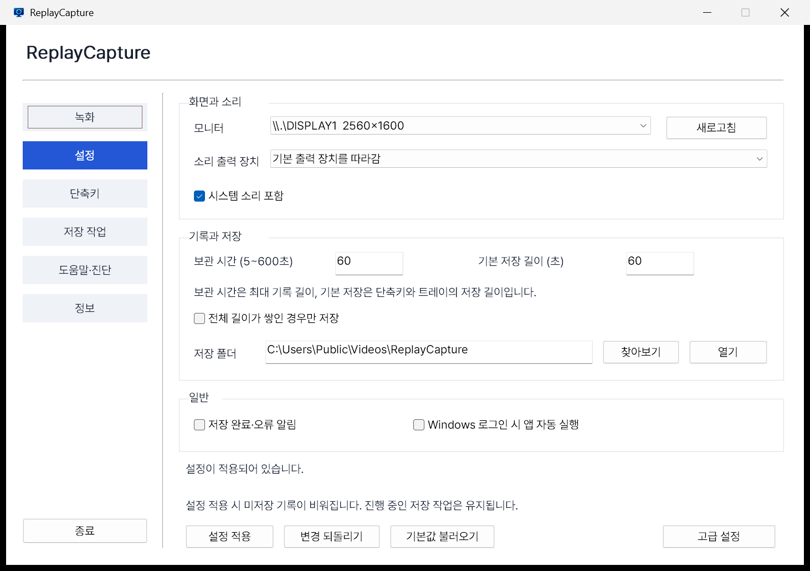

# GUI 고정 크기 및 표시 오류 수정 보고서

## 후속 변경: 녹화 제어 간소화 및 정보 탭

- ‘이번 저장 길이’를 ‘저장 길이’로 변경하고 저장 버튼을 기존 안내 문구 위치로 이동했습니다. 일반 안내 문구와 단축키 바로가기 버튼을 제거했습니다.
- 녹화 제어는 시작·중지만 제공합니다. 녹화 중에는 중지 버튼이 빨간색입니다. 일시정지와 버퍼 비우기는 사용자 명령과 트레이 메뉴에서 제거했습니다.
- 소리 연결 실패 시 영상만 녹화하는 동작은 항상 허용합니다. 이전 설정에서 허용하지 않았더라도 적용됩니다.
- 도움말·진단의 장치 재연결과 하단 문구를 제거하고 종료 버튼명을 ‘종료’로 변경했습니다.
- 정보 탭에 개발자, 연락처, GitHub, 버전, 저작권, 개인·비영리 무료 사용권 및 제3자 라이선스 안내를 추가했습니다. [사용권 전문](../SOFTWARE_LICENSE.ko.md)은 배포본에도 포함합니다.
- 검증: Release 빌드·단위 시험, 6개 메뉴 12회 전환, 삭제 컨트롤 부재, 정보 탭 표시, 녹화 중 중지 버튼의 빨간색 픽셀, 녹화·저장·전역 단축키와 설정 복원 통과. 존재하지 않는 소리 장치와 과거 `allowVideoOnly=false` 설정으로도 영상만 녹화·저장됨을 확인했습니다.
- 재현: `python tests/gui_layout_probe.py --run-name simplified-layout`, `python tests/ui_probe.py --run-name simplified-ui`.

아래는 최초 고정 크기 변경 당시 기록이며, 이후 제거된 기능의 현재 동작은 위 내용을 따릅니다.

2026-09-11 기준. 이전 가변 창 설계를 사용자 요청에 따라 고정 창으로 변경했습니다.

## 사용자에게 달라진 점

| 항목 | 적용 결과 |
|---|---|
| 창 크기 | 본문 960×650 DIP 기준 고정. 최대화·크기 조절·전체 창 스크롤 제거. Windows 배율과 작업 영역 반영 |
| 메뉴 선택 | 이전 메뉴의 배경까지 다시 그려 현재 메뉴 하나만 파란색으로 표시 |
| 입력·버튼 | 숫자 입력 폭 약 76~100 DIP, 일반 버튼 높이 28~30 DIP로 축소 |
| 기능 구분 | 상태·저장·제어·저장 위치, 장치·기록·일반 설정 등을 테두리로 구분 |
| 고급 설정 | 기본 설정과 같은 영역에서 전환하며 하단 적용 버튼을 계속 표시 |
| 글꼴 | Pretendard 1.3.9 Regular/SemiBold 내장. 별도 설치 불필요 |
| 상단 문구 | ‘지나간 순간을, 화면과 소리 그대로’ 삭제 |

## 개발자 참고

중첩된 그룹 박스 자식 창이 다른 컨트롤과 겹쳐 그려지는 문제를 없애기 위해 테두리를 부모 창에서 직접 그립니다. 페이지 전환 시 이전 컨트롤을 숨기고 전체 영역과 자식을 다시 그립니다. 작업 목록과 진단 입력창의 자체 스크롤은 유지합니다.

글꼴은 실행 파일 리소스에 포함하고 `AddFontMemResourceEx`로 해당 프로세스에만 등록합니다. 불러오기 실패 시 맑은 고딕을 사용합니다. [공식 저장소](https://github.com/orioncactus/pretendard)의 배포본을 수정 없이 사용하며 [SIL OFL 라이선스](../assets/fonts/OFL.txt)와 [출처](../assets/fonts/SOURCES.md)를 ZIP에 동봉합니다.

## 검증

- Release 빌드 및 단위 시험 통과.
- 격리 GUI 통합 시험: 녹화·일시정지·재개·중지, 버튼 저장, 숨긴 창에서 변경된 전역 단축키 저장, 충돌 시 기존 단축키 유지, 설정 재시작 복원 통과.
- 고정 배치 시험: 크기 조절/최대화 스타일 제거, 최대화 명령 무시, 10회 메뉴 전환에서 파란색 선택이 하나인 것을 이미지 픽셀로 확인.
- 스크롤 명령 전후 위치 유지, 각 화면 컨트롤의 본문 영역 내 배치, 고급 설정 전환·검증 메시지·되돌리기 통과.
- 실제 GDI 선택 글꼴이 Pretendard임을 확인. 녹화·기본 설정·고급 설정 이미지를 직접 검토하여 겹침과 잔상 수정 확인.

재현: `scripts/build.ps1`, `python tests/ui_probe.py --run-name fixed-gui-final`, `python tests/gui_layout_probe.py --run-name fixed-layout-final`.

시험은 별도 설정 및 창 식별자를 사용하는 인스턴스로 실행했습니다. 실제 다중 모니터 DPI 전환, 모든 해상도·접근성 모드 및 장시간 성능 시험을 이번 수정에서 다시 검증한 것은 아닙니다. 이전 성능 측정은 [이전 보고서](GUI_IMPLEMENTATION_REPORT.ko.md)에 날짜와 함께 남겨 둡니다.
