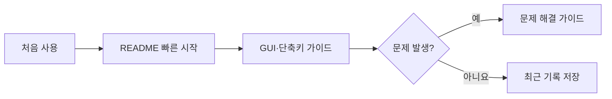

# ReplayCapture 문서 안내 📚

ReplayCapture 문서는 **배포 프로그램을 사용하는 일반 사용자**와 **소스 코드를 다루는 외부 개발자**의 경로를 분리합니다.

## 👤 일반 사용자

| 먼저 읽을 문서 | 언제 필요한가요? |
|---|---|
| [프로젝트 README](../README.md#-일반-사용자-가이드) | 프로그램의 목적과 핵심 사용법을 빠르게 보고 싶을 때 |
| [GUI·단축키 사용자 가이드](gui-and-hotkeys.md) | 각 버튼과 설정을 순서대로 사용하고 싶을 때 |
| [문제 해결 가이드](troubleshooting.md) | 녹화, 소리, 단축키, 저장 파일에 문제가 있을 때 |

## 🛠️ 외부 개발자

| 문서 | 내용 |
|---|---|
| [프로젝트 README](../README.md#-외부-개발자-가이드) | 기술 스택, 빌드, 문서 진입점 |
| [아키텍처](architecture.md) | 모듈 경계, 캡처·버퍼·내보내기 흐름 |
| [GUI 디자인 개선 계획](GUI_DESIGN_IMPROVEMENT_PLAN.ko.md) | 화면 재설계, 상태별 행동, 접근성, 구현 단계와 검증 기준 |
| [GUI 구현·성능 보고서](GUI_IMPLEMENTATION_REPORT.ko.md) | 적용한 화면 개선, 회귀 시험, 성능 측정과 검증 한계 |
| [고정 GUI 수정 보고서](GUI_FIXED_LAYOUT_REPORT.ko.md) | 고정 크기, 선택 표시·잔상 수정, 글꼴과 최신 화면 검증 |
| [검증 보고서](validation-report.md) | 검증 환경, 확인된 동작, 남은 검증 |
| [초기 구현 계획](../WINDOWS_REPLAY_RECORDER_PLAN.ko.md) | 최초 요구사항, 단계별 설계와 수용 기준의 역사 기록 |

> 문서와 실제 동작이 다르면 현재 버전의 프로그램 동작과 [검증 보고서](validation-report.md)를 우선해 확인해 주세요.
